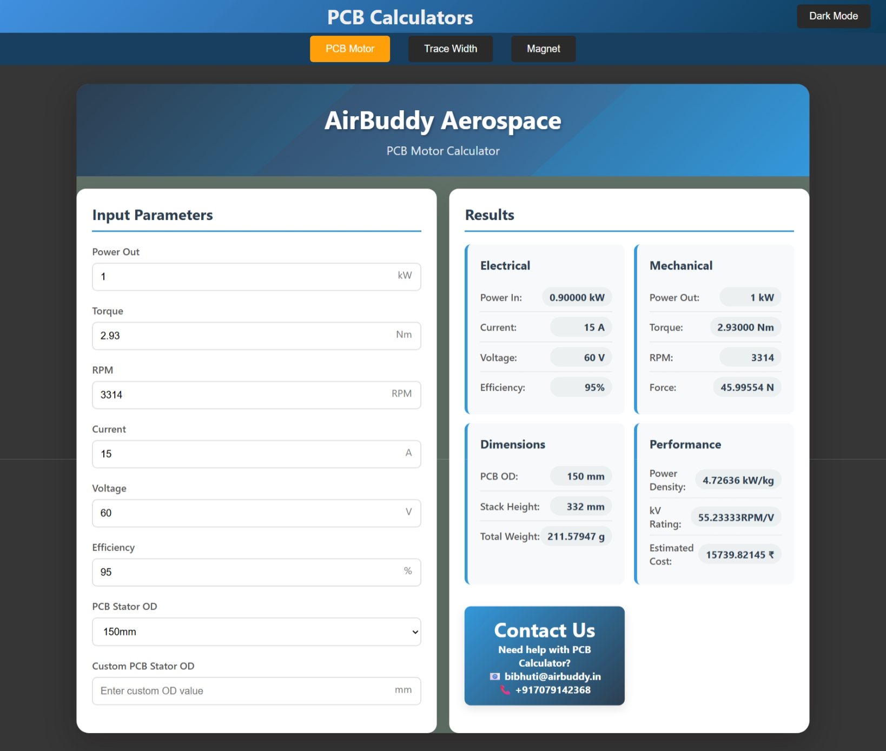
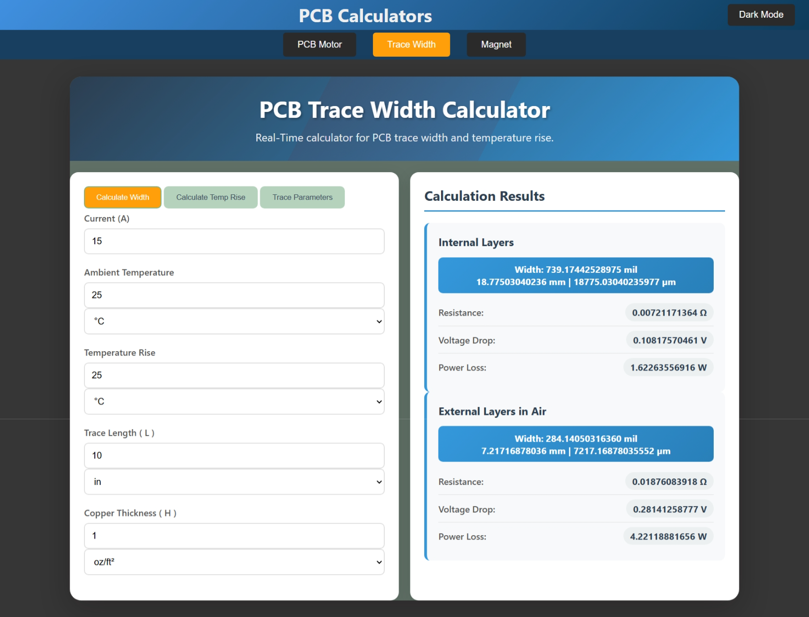
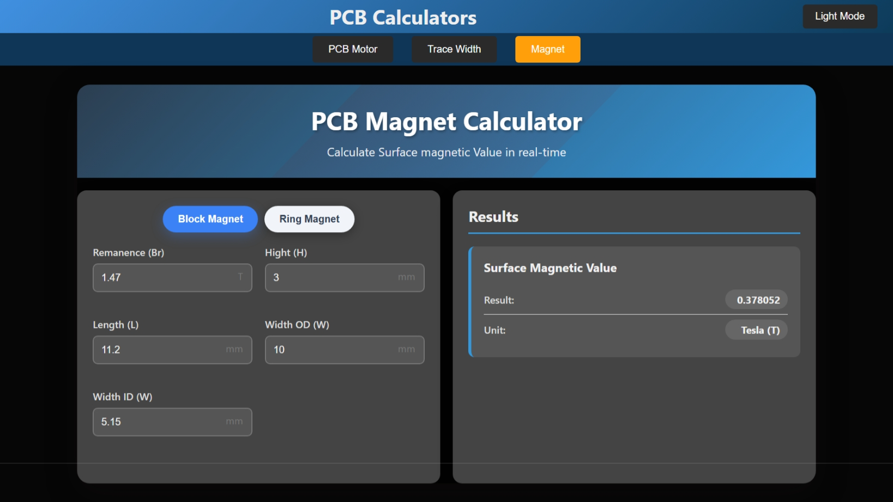

# All-in-One PCB Calculator

A web-based tool that brings together three powerful calculators for PCB design:
- **PCB Motor Calculator**
- **PCB Trace Width Calculator**
- **PCB Magnet Calculator**

Built with HTML, CSS, and JavaScript, the calculator works entirely in the browser with no installation required.

---

## Features

### 🔹 PCB Motor Calculator
- Calculates **Power In**, **Power Out**, **Torque**, **RPM**, **Efficiency**, and **kV Rating**.
- Provides **Force, PCB OD, Stack Height, Total Weight**, and **Power Density**.
- Includes **Estimated Cost** metrics.
- Ideal for analyzing PCB stator motors.

### 🔹 PCB Trace Width Calculator
- Implements **IPC-2221/2152 standards** for trace sizing.
- Real-time calculations with instant visual feedback
- Modes:
  - **Width Calculation** (from current and temperature rise)
  - **Temperature Rise Calculation** (from current and width)
  - **Trace Parameters** (resistance, voltage drop, power loss, cross-sectional area, volume).
- Comprehensive unit support:
  - Current (A)
  - Temperature (°C, °F)
  - Thickness (oz/ft², mil, mm, µm)
  - Trace Length (in, ft, mil, mm, µm, cm, m)
- Handles **internal** and **external copper layers** separately
- Advanced features:
  - Real-time resistance calculation
  - Voltage drop estimation
  - Power loss analysis
  - Temperature compensation

### 🔹 PCB Magnet Calculator
- Real-time calculation of **surface magnetic values**.
- Supports:
  - **Block Magnet**
  - **Ring Magnet**
- Input parameters include **remanence (Br)**, **dimensions (H, L, W, OD, ID)**.
- Outputs field strength and surface values.

---

## Getting Started

### Option 1. Clone the Repository
```bash
git clone https://github.com/ajit421/PCB_Calculator.git
cd PCB_Calculator
````

### Option 2. Run in Browser

Simply open the `index.html` file in your browser.

No dependencies, servers, or installations required.

### Option 3. Open Online

* [Netlify Deployment](https://pcb-calculator.netlify.app/)
* [GitHub Pages Deployment](https://ajit421.github.io/PCB_Calculator)

---

## Screenshots

### PCB Motor Calculator



### PCB Trace Width Calculator



### PCB Magnet Calculator



---

## Technologies Used

* **HTML5** for structure and semantic markup
* **CSS3** for:
  * Responsive UI design
  * Dark/Light mode support
  * Smooth transitions and animations
  * Mobile-friendly layout
* **JavaScript** for:
  * Real-time calculations
  * Dynamic unit conversions
  * Instant result updates
  * Data validation
* **Python** implementations available for:
  * PCB trace width calculations
  * Magnetic field computations
  * Advanced PCB parameter analysis

---


## Contact

Project developed at **AirBuddy Aerospace**

📧 [bibhuti@airbuddy.in](mailto:bibhuti@airbuddy.in)
📞 +91 7079142368

**Developer Contact**
📞 +91 6205607900


